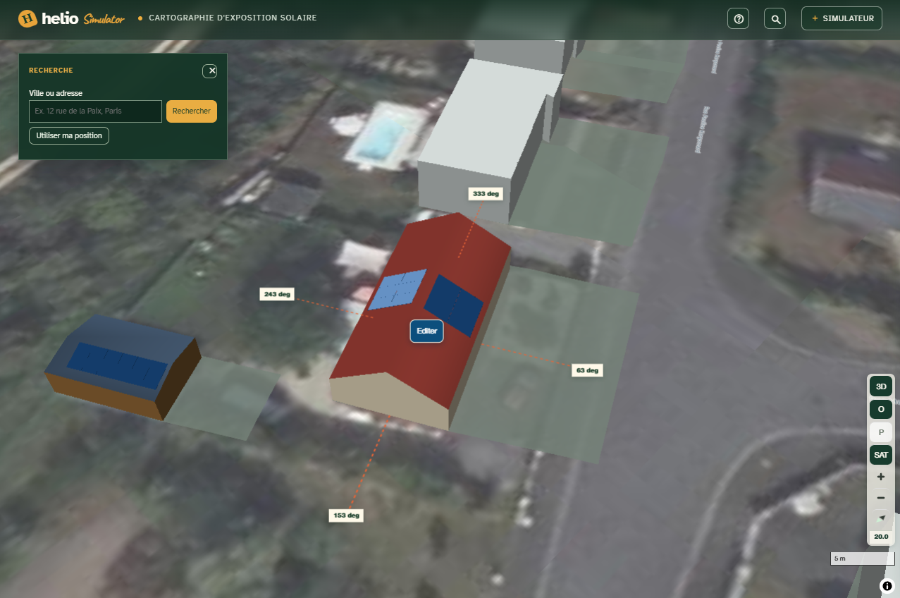
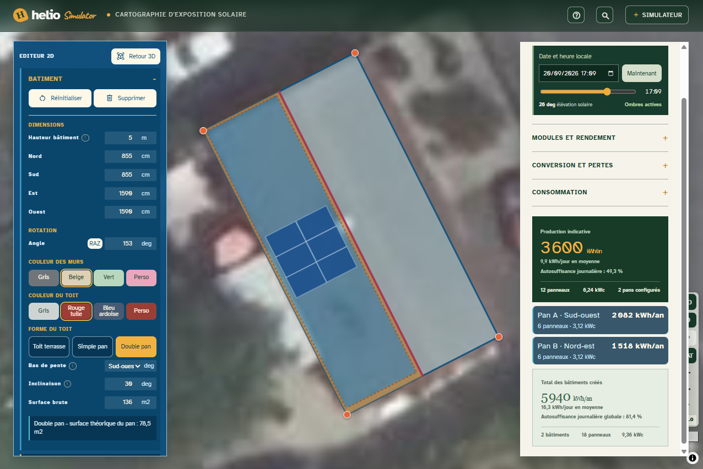
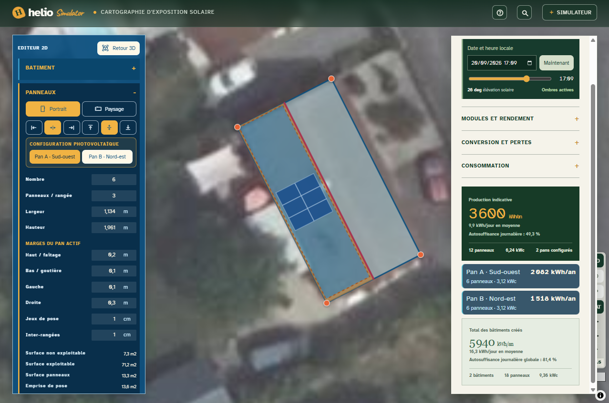

# Helio Simulator

Application web cartographique de simulation solaire 3D pour explorer l'implantation de panneaux photovoltaïques sur des bâtiments.

**Helio Simulator est un outil informatif et ludique.** Les résultats sont indicatifs et ne constituent ni une étude technique, financière, réglementaire ou structurelle, ni une garantie de production.

<p align="center">
  
  
  
</p>

## Fonctionnalités

- Recherche d'adresse et mémorisation locale du dernier point de départ.
- Visualisation cartographique 3D avec simulation de l'heure, de la date, du soleil et des ombres.
- Création, sélection et édition directe des emprises de bâtiments en 2D.
- Toitures terrasse, simple pan et double pan avec contrôles de hauteur, pente, orientation, rotation et couleurs.
- Pose de panneaux avec dimensions, orientation, marges, alignement, retraits et contraintes géométriques visibles.
- Réglages photovoltaïques indépendants pour les deux pans d'une toiture double.
- Volumes 3D des bâtiments et panneaux de 3 cm, avec reflet solaire dynamique.
- Estimation indicative de la puissance, de la production, de l'autosuffisance et du surplus, par bâtiment et pour l'ensemble des bâtiments créés.
- Persistance locale des créations et réglages dans le navigateur.

## Démo en ligne

Une démo de Helio Simulator est accessible sur [fcinc.fr/heliosim](https://fcinc.fr/heliosim/).

## Technologies

- [Vite](https://vite.dev/)
- [MapLibre GL JS](https://maplibre.org/)
- [SunCalc](https://github.com/mourner/suncalc)
- Fonds CARTO et données cartographiques publiques

## Démarrage

Prérequis: Node.js 24 ou plus récent.

1. Créer `.env` à partir de `.env.example`.
2. Renseigner la clé publique CARTO:

```env
VITE_CARTO_API_KEY=votre_cle_publique_carto
```

La clé est exposée au navigateur pour charger les tuiles; elle doit donc être restreinte aux domaines de déploiement autorisés dans CARTO.

```sh
npm install
npm run dev
```

Vite affiche l'adresse locale à ouvrir dans un navigateur.

## Vérification

```sh
npm test
npm run build
```

La build met à jour la version affichée par l'application avant de produire `dist/`.

## Déploiement

La build de production est configurée pour [fcinc.fr/heliosim](https://fcinc.fr/heliosim/). Publier le contenu de `dist/` dans le répertoire statique associé à ce chemin. La configuration serveur est décrite dans `DEPLOIEMENT_APACHE_NGINX.md`.

## Structure

- `src/main.js`: interface, état de l'étude et interactions cartographiques.
- `src/solar.js`: calculs déterministes d'estimation.
- `src/solar3d.js`: géométrie des bâtiments et panneaux 3D.
- `src/solar3d-layer.js`: calque WebGL personnalisé.
- `src/*.test.js`: tests Node.js.
- `src/style.css` et `src/editor.css`: interface responsive.
- `scripts/update-build-version.mjs`: version de build.

## Limites

Les données, ombres, rendements et productions calculés restent simplifiés. Une étude qualifiée nécessiterait notamment des données de toiture et d'altimétrie fiables, des masques d'ombrage complets, une source d'irradiation traçable telle que PVGIS et une validation professionnelle.

## Crédits

Réalisé par FC avec OpenCode et ChatGPT 5.6 Terra Fast.

## Licence

Ce code est distribué sous [PolyForm Noncommercial 1.0.0](LICENSE). Toute utilisation commerciale nécessite l'accord préalable du titulaire des droits.
